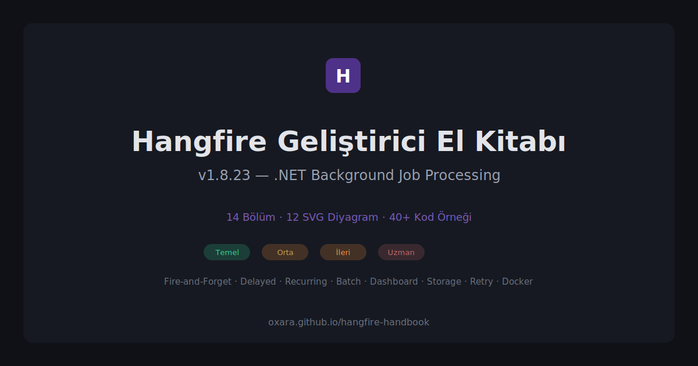

  

# Hangfire Geliştirici El Kitabı

.NET uygulamalarında Hangfire'ı yalnızca çalıştırmak değil, production ortamında güvenilir biçimde işletmek için hazırlanmış Türkçe bir başvuru kaynağı.

Kurulumdan job tasarımına; retry, idempotency, dashboard güvenliği, storage seçimi, ölçekleme, monitoring ve container deployment konularına kadar uçtan uca bir yol sunar.

  <a href="https://oxara.github.io/hangfire-handbook/"><strong>Canlı rehberi aç</strong></a>
  ·
  <a href="https://oxara.github.io/hangfire-handbook/#production-checklist-amp-docker-uzman"><strong>Production checklist</strong></a>

## Bu rehber neyi çözüyor?

Hangfire'ın temel API'sini öğrenmek kolaydır. Zor olan, sistem production'a çıktığında ortaya çıkan sorulara doğru cevap vermektir:

- Job argümanlarında neden entity yerine ID taşınmalı?
- Retry sırasında aynı ödeme veya e-posta işlemi nasıl tekrar edilmez?
- Recurring job'ların üst üste çalışması nasıl engellenir?
- Dashboard production'da nasıl yetkilendirilir?
- SQL Server, Redis veya PostgreSQL storage hangi durumda seçilir?
- Worker ve queue yapısı nasıl ölçeklenir?
- Failed job oranı, queue derinliği ve çalışma süresi nasıl izlenir?
- Deploy sırasında çalışan job'lar nasıl korunur?

Rehber, bu soruları kod örnekleri, karar tabloları, mimari diyagramlar ve gerçek kullanım senaryolarıyla yanıtlar.

## Kimler için?

- Hangfire'a yeni başlayan .NET geliştiricileri
- Mevcut job altyapısını production'a hazırlayan ekipler
- Retry, duplicate execution veya queue birikmesi sorunları yaşayan projeler
- Storage ve ölçekleme kararı veren teknik liderler
- Operasyon, monitoring ve deployment standardı oluşturmak isteyen ekipler

## İçerik haritası

### Temel

Hangfire'ın çalışma modelini ve temel job türlerini kurar.

- [Giriş ve Kurulum](https://oxara.github.io/hangfire-handbook/#giris-amp-kurulum-temel)
- [Fire-and-Forget Jobs](https://oxara.github.io/hangfire-handbook/#fire-and-forget-jobs-temel)
- [Delayed Jobs](https://oxara.github.io/hangfire-handbook/#delayed-jobs-temel)
- [Recurring Jobs ve CRON](https://oxara.github.io/hangfire-handbook/#recurring-jobs-cron-temel)

### Orta

Job zincirleri, lifecycle davranışları, hata yönetimi ve test stratejilerine geçer.

- [Continuations ve Batch Jobs](https://oxara.github.io/hangfire-handbook/#continuations-amp-batch-jobs-orta)
- [Job Filters ve Middleware](https://oxara.github.io/hangfire-handbook/#job-filters-amp-middleware-orta)
- [Retry ve Error Handling](https://oxara.github.io/hangfire-handbook/#retry-amp-error-handling-orta)
- [Testing Strategies](https://oxara.github.io/hangfire-handbook/#testing-strategies-orta)

### İleri

Production güvenliği, storage mimarisi ve dağıtık çalışma kararlarını ele alır.

- [Dashboard ve Güvenlik](https://oxara.github.io/hangfire-handbook/#dashboard-amp-guvenlik-ileri)
- [Storage Seçimi](https://oxara.github.io/hangfire-handbook/#storage-secimi-ileri)
- [Best Practices ve Anti-Patterns](https://oxara.github.io/hangfire-handbook/#best-practices-amp-anti-patterns-ileri)
- [Performance ve Scaling](https://oxara.github.io/hangfire-handbook/#performance-amp-scaling-ileri)

### Uzman

Sistemi ölçülebilir, gözlemlenebilir ve deployment'a hazır hale getirir.

- [Monitoring ve Alerting](https://oxara.github.io/hangfire-handbook/#monitoring-amp-alerting-uzman)
- [Production Checklist ve Docker](https://oxara.github.io/hangfire-handbook/#production-checklist-amp-docker-uzman)

## Rehberin yaklaşımı

- Kopyalanabilir C#, SQL, JSON, YAML ve Docker örnekleri
- Karar vermeyi kolaylaştıran açık öneri ve gerekçe tabloları
- SQL Server, Redis ve PostgreSQL için sekmeli konfigürasyon örnekleri
- Light ve dark mode uyumlu mimari diyagramlar
- Anti-pattern ve doğru kullanım karşılaştırmaları
- E-ticaret, fintech ve SaaS senaryoları
- Sayfa içi arama, seviye gruplu menü ve kod kopyalama desteği

## Öne çıkan production ilkeleri

1. Job argümanlarında büyük nesneler yerine kimlik taşıyın.
2. Her job'ı retry ve duplicate execution ihtimaline karşı idempotent tasarlayın.
3. Dashboard'u public erişime açmayın ve yazma işlemlerini rol bazlı sınırlayın.
4. Queue ve worker sayılarını iş önceliğine ve kaynak tüketimine göre ayırın.
5. Failed job oranı, queue derinliği ve job süreleri için ölçüm ve alarm kurun.
6. Graceful shutdown süresini en uzun job süresiyle uyumlu planlayın.

## Teknik yapı

Rehber statik ve semantik HTML olarak yayınlanır. Ortak arayüz feature'ları sürümlü olarak [Oxara.DocumentTemplate](https://github.com/Oxara/Oxara.DocumentTemplate) reposundan tüketilir.

Ana içerik [index.html](index.html) dosyasındadır. Markdown parser veya runtime içerik üretimi kullanılmaz; JavaScript yalnızca tema, arama, menü, sekmeler ve kod araçları gibi arayüz davranışlarını sağlar.

## Katkı

Yanlış, eksik veya güncelliğini kaybetmiş bir bölüm görürseniz issue açabilir ya da doğrudan pull request gönderebilirsiniz. Özellikle production deneyimlerinden gelen edge case ve doğrulama katkıları değerlidir.

## Lisans

MIT
